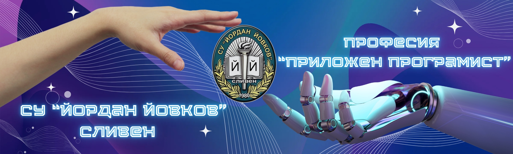
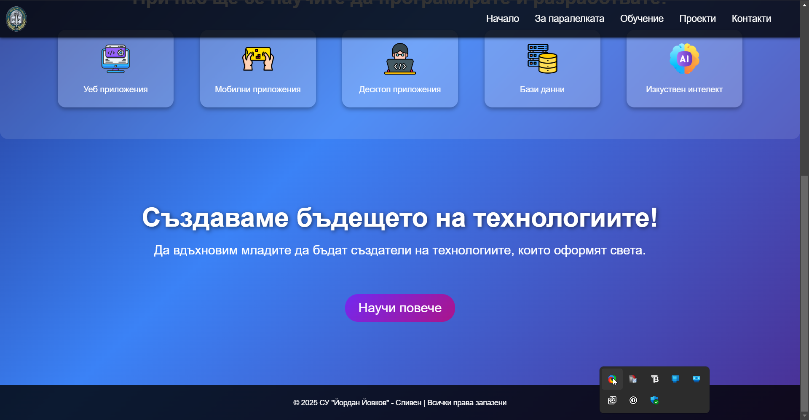
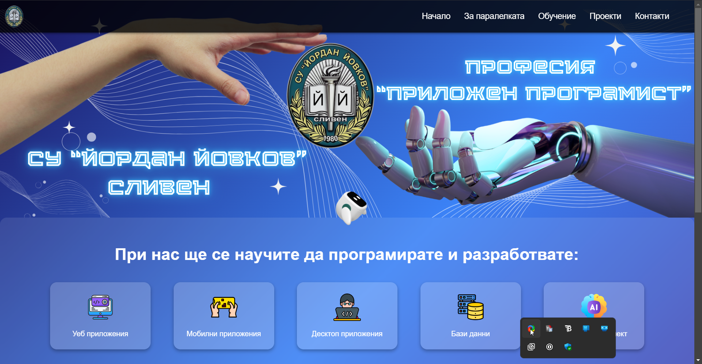

# 🎓 XSU - Представяне на нашето училище

Добре дошли в **XSU** - училищен проект, който демонстрира възможностите и уменията, които развиваме в **СУ "Йордан Йовков"**. Тук ще откриете информация за нашите **проекти, технологии и творчески идеи**.

---

## 🚀 **Какво представлява проектът?**
XSU е интерактивен уебсайт/приложение, който:
- ✅ Представя училището и неговите възможности 📚
- ✅ Включва информация за клубове, специалности и събития 🎭
- ✅ Демонстрира нашите умения по **програмиране, дизайн и мултимедия** 💻🎨
- ✅ Позволява на учениците да добавят свои проекти и разработки 🛠️

---

## 🏫 **Защо избрахме този проект?**
Нашата цел е да **създадем платформа**, чрез която да покажем на всички **какво можем да правим**. Вярваме, че **технологиите и креативността** вървят ръка за ръка и искаме да докажем това!

### 🎯 **Основни цели на проекта:**
- 📌 Представяне на нашите **умения и знания**
- 📌 Създаване на **полезен ресурс за ученици и учители**
- 📌 Популяризиране на нашето училище 🏫

---

## 🛠 **Използвани технологии**
Проектът е разработен с **най-новите технологии**, които използваме в обучението си:

| Технология | Описание |
|------------|------------|
|  | Структура на уеб страниците |
|  | Дизайн и стилизиране |
|  | Динамична логика и интерактивност |

---

## 📸 **Преглед на проекта**

---
